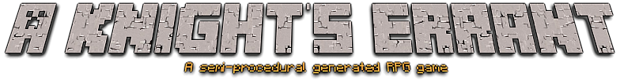

<h1 align="center">
  <br>
  <a href="https://github.com/shreyasborole/AKnightsErrant"></a>
</h1>
<h4 align="center">A 2D RPG Adventure And Action Game.</h4>
<br>


***
>## INTRODUCTION
***
```
A Knight’s Errant is a procedurally generated 2D open-world RPG style adventure & exploration game, inspired by the likes of Minecraft, Dungeon Crawlers and Forager.
The maps and biomes are procedurally generated.
A map has different biomes (terrains) each having different kinds of resources, enemies, traps and bandits.
```
***